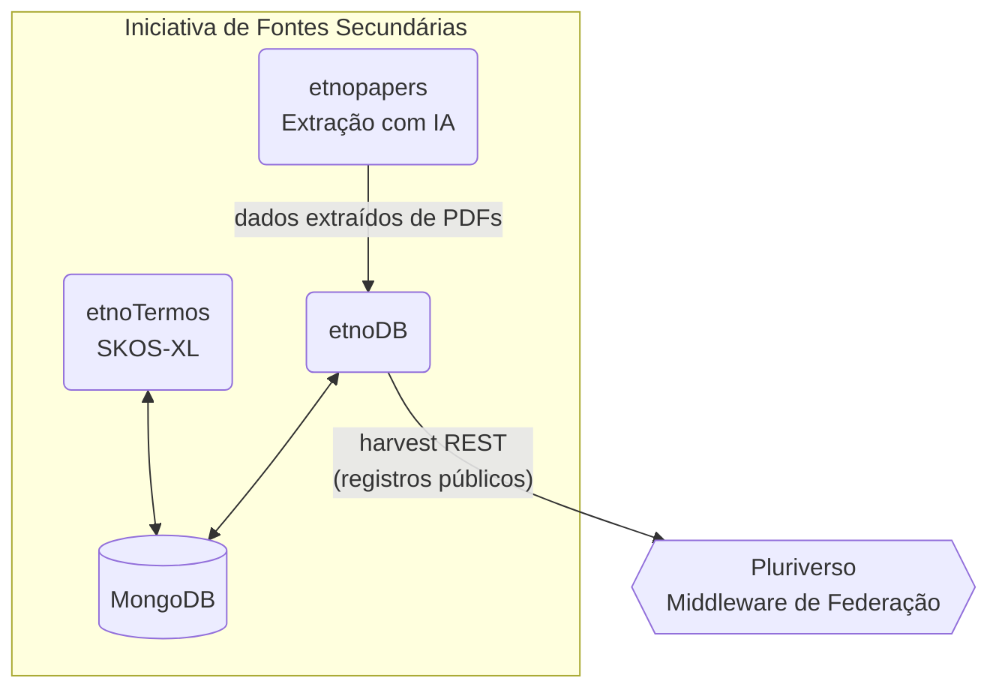

# EtnoPapers

  
  
  
  

**Aplicação Desktop para Extração Automatizada de Metadados Etnobotânicos**

**Versão Atual**: 2.1.0 | [Ver Histórico de Versões](VERSION_HISTORY.md)

> **✨ Novidade na v2.1.0**: Integração completa com o projeto etnoDB! Nova estrutura de dados padronizada conforme [etnoDB Data Structure](https://github.com/edalcin/etnoDB?tab=readme-ov-file#estrutura-de-dados) para sincronização perfeita com o banco de dados central. [Saiba mais](VERSION_HISTORY.md#versão-210---dezembro-2025)

> "Se os dados não estão fisicamente sob o controle de quem os gerou, a soberania é apenas uma promessa bonita em um termo de consentimento."
>
> — Eduardo Dalcin, em [*Sementes Livres, Solos Próprios: Por que o Conhecimento Tradicional exige uma Arquitetura Federada*](https://eduardo.dalc.in/por-que-o-conhecimento-tradicional-exige-uma-arquitetura-federada/), post que resume e ilustra didaticamente a arquitetura federada na qual o etnoPapers atua como ferramenta de extração automatizada para iniciativas de fontes secundárias.

---

> ## 🔗 Projeto etnoDB
>
> **Este projeto faz parte do [etnoDB](https://github.com/edalcin/etnoDB)**, um sistema completo de banco de dados etnobotânicos provenientes de dados secundários (artigos científicos publicados).
>
> O **EtnoPapers** serve como **ferramenta alternativa de entrada de dados** ao etnoDB, permitindo a **extração automatizada de metadados de artigos científicos** usando inteligência artificial, complementando a **entrada manual de dados pela interface do etnoDB**.
>
> **🎯 Fluxo de trabalho integrado:**
> 1. **EtnoPapers** → Extração automatizada de PDFs com IA
> 2. **MongoDB** → Armazenamento centralizado de dados
> 3. **etnoDB** → Visualização, curadoria e entrada manual complementar
>
> Para mais informações sobre o projeto etnoDB, visite: **https://github.com/edalcin/etnoDB**

---

## Sobre o EtnoPapers

O EtnoPapers é uma aplicação desktop nativa para Windows desenvolvida para pesquisadores em etnobotânica que precisam catalogar e organizar dados sobre o uso tradicional de plantas por comunidades indígenas e tradicionais.

Com o EtnoPapers, você pode:

- ✨ **Extrair automaticamente** metadados de artigos científicos em PDF usando inteligência artificial
- 📝 **Gerenciar** suas referências com interface completa de edição (criar, visualizar, editar, deletar)
- ☁️ **Sincronizar** seus dados com MongoDB (Atlas ou servidor local) para backup e segurança
- 🔧 **Personalizar** a extração com prompts configuráveis para o modelo de IA
- 🌿 **Catalogar** espécies de plantas, comunidades estudadas, localizações geográficas e metodologias

## Funcionalidades Principais

### 🤖 Extração Inteligente com IA em Nuvem (v2.0!)

Carregue seus artigos em PDF e deixe a inteligência artificial extrair automaticamente com **máxima precisão e desempenho**:

**💡 Nova tecnologia v2.0**: Extração via provedores de IA em nuvem (Google Gemini, OpenAI, Anthropic Claude) com **50% de melhoria de desempenho** em relação à versão local (v1.x com OLLAMA). Sem necessidade de GPU ou software adicional!

- **Metadados obrigatórios**: título (normalizado), autores (formato APA), ano de publicação, resumo (em português brasileiro)
- **Dados etnobotânicos**: espécies de plantas (nomes vernaculares e científicos), tipos de uso, comunidades estudadas
- **Dados geográficos**: país, estado, município, localização específica
- **Informações do estudo**: fonte de publicação, metodologia aplicada
- **Provedores suportados**: Google Gemini (gratuito), OpenAI, Anthropic Claude

### 📚 Gestão Completa de Referências

Interface intuitiva para gerenciar todas as suas referências processadas:

- Visualize todas as fichas extraídas em formato de tabela organizada
- Edite qualquer campo dos registros, incluindo adição de novos atributos personalizados
- Crie novos registros manualmente quando necessário
- Delete referências que não são mais necessárias
- Marque fichas para envio ao banco de dados remoto

### ☁️ Sincronização com MongoDB

Mantenha seus dados seguros e acessíveis:

- Conecte-se ao MongoDB Atlas (nuvem) ou servidor local
- Selecione quais fichas deseja enviar para o banco de dados
- Upload automático com confirmação de sucesso
- Registros enviados com sucesso são removidos do armazenamento local
- Avisos automáticos para lembrar você de fazer backup regular

### ⚙️ Configuração Flexível

- Configure o prompt de IA para personalizar a extração de dados
- Informe a URI de conexão com seu MongoDB
- Configurações persistem entre sessões
- Indicadores de status de conexão para IA e banco de dados

---

## Requisitos do Sistema

### Requisitos Obrigatórios

- **Sistema Operacional**: Windows 10 ou superior
- **Provedor de IA em Nuvem**: Chave de API de um dos seguintes:
  - Google Gemini API ([obter chave](https://ai.google.dev/))
  - OpenAI API ([obter chave](https://platform.openai.com/))
  - Anthropic Claude API ([obter chave](https://console.anthropic.com/))
- **Conexão com Internet**: Necessária para:
  - Extração de metadados usando IA em nuvem
  - Sincronização com MongoDB Atlas

### Recomendações

- **MongoDB**: Conta no MongoDB Atlas (gratuita) ou servidor MongoDB local para backup de dados

---

## Instalação

1. **Baixe o EtnoPapers**
   - Acesse a seção de Releases no GitHub
   - Baixe a versão mais recente do instalador
   - Execute o instalador e siga as instruções

2. **Obtenha uma Chave de API de IA**

   Escolha **um** dos seguintes provedores:

   **Opção 1: Google Gemini** (Recomendado - gratuito até 15 requisições/minuto)
   - Acesse [Google AI Studio](https://ai.google.dev/)
   - Crie uma conta Google (se não tiver)
   - Clique em "Get API Key"
   - Copie sua chave de API

   **Opção 2: OpenAI**
   - Acesse [OpenAI Platform](https://platform.openai.com/)
   - Crie uma conta
   - Navegue até "API Keys" e crie uma nova chave
   - Adicione créditos à conta (pago por uso)

   **Opção 3: Anthropic Claude**
   - Acesse [Anthropic Console](https://console.anthropic.com/)
   - Crie uma conta
   - Gere uma API key
   - Adicione créditos à conta (pago por uso)

3. **Configure o EtnoPapers**
   - Abra o EtnoPapers
   - Vá para **Configurações**
   - Selecione seu provedor de IA (Gemini, OpenAI ou Anthropic)
   - Cole sua chave de API
   - Clique em **Salvar**

4. **Configure o MongoDB** (opcional, mas recomendado)
   - Crie uma conta gratuita no MongoDB Atlas ou instale um servidor local
   - Obtenha a URI de conexão do seu banco de dados
   - Configure a URI nas configurações do EtnoPapers

---

## Como Usar

### Primeira Configuração

1. Abra o EtnoPapers
2. Vá para a área de **Configurações**
3. Selecione seu provedor de IA em nuvem (Gemini, OpenAI ou Anthropic)
4. Cole sua chave de API do provedor escolhido
5. Clique em **Salvar** para armazenar as configurações
6. Informe a URI de conexão com o MongoDB (opcional)
7. Teste a conexão com o MongoDB

### Processar um Artigo

1. Na tela principal, clique em **Upload de PDF** ou arraste um arquivo para a área designada
2. Aguarde o processamento - o sistema mostrará uma janela de progresso
3. Após a extração, a janela de edição abrirá automaticamente
4. Revise os dados extraídos pela IA
5. Edite qualquer campo conforme necessário
6. Adicione informações complementares ou atributos personalizados
7. Clique em **Salvar** para armazenar o registro localmente

### Gerenciar Referências

1. Acesse a aba **Registros**
2. Visualize todas as fichas processadas em formato de tabela
3. A lista é atualizada automaticamente sempre que você visita a página
4. Veja as principais informações: Título, Ano, Autores e País
5. Selecione registros para editar ou sincronizar com MongoDB

### Sincronizar com MongoDB

1. Na aba **Registros**, selecione os registros que deseja enviar para o banco de dados
2. Clique em **Sincronizar com MongoDB**
3. Aguarde a confirmação de upload
4. Registros enviados com sucesso serão removidos do armazenamento local

> ⚠️ **Importante**: Faça upload regular dos seus dados para o MongoDB para garantir backup e bom desempenho do sistema. O armazenamento local tem limite de registros.

---

## Dados Extraídos

### Campos Obrigatórios

Sempre extraídos de cada artigo:

- **Título** (normalizado)
- **Autores** (formato APA)
- **Ano** de publicação
- **Resumo** (sempre em português brasileiro)

### Campos Opcionais

Extraídos quando disponíveis no documento:

- Fonte de publicação
- **Espécies de plantas** (nome vernacular, nome científico, tipo de uso)
- **Comunidades estudadas** (nome, localização)
- **Dados geográficos** (país, estado, município, local específico)
- **Metodologia** do estudo

### Estrutura de Dados

**Versão 2.1**: A estrutura de dados foi atualizada para integração completa com o [etnoDB](https://github.com/edalcin/etnoDB?tab=readme-ov-file#estrutura-de-dados).

**Principais campos:**
- `createdAt` / `updatedAt`: Timestamps no formato ISO 8601 (ex: "2025-12-26T11:02:00.533+00:00")
- `status`: Status do registro ("pending", "approved", "rejected")
- `fonte`: Origem dos dados no formato "etnodb - [Provedor IA]" (ex: "etnodb - Gemini")

Para detalhes completos da estrutura de dados, consulte:
- Arquivo de exemplo: [`docs/estrutura.json`](docs/estrutura.json)
- Documentação oficial: [etnoDB Data Structure](https://github.com/edalcin/etnoDB?tab=readme-ov-file#estrutura-de-dados)

---

## ☁️ Provedores de IA em Nuvem

### Comparação de Provedores

O EtnoPapers suporta três provedores de IA em nuvem para extração de metadados:

| Aspecto | Google Gemini | OpenAI | Anthropic Claude |
|---------|--------------|--------|------------------|
| **Modelo Padrão** | Gemini 1.5 Flash | GPT-4o-mini | Claude 3.5 Haiku |
| **Custo** | ✅ Gratuito (até 15/min) | 💰 Pago por uso | 💰 Pago por uso |
| **Velocidade** | ⚡⚡⚡⚡ (muito rápido) | ⚡⚡⚡ (rápido) | ⚡⚡⚡⚡ (muito rápido) |
| **Precisão** | ⭐⭐⭐⭐⭐ (excelente) | ⭐⭐⭐⭐⭐ (excelente) | ⭐⭐⭐⭐⭐ (excelente) |
| **Suporte a Português** | ⭐⭐⭐⭐⭐ (nativo) | ⭐⭐⭐⭐⭐ (nativo) | ⭐⭐⭐⭐⭐ (nativo) |
| **Extração Estruturada** | ⭐⭐⭐⭐⭐ (JSON nativo) | ⭐⭐⭐⭐⭐ (JSON nativo) | ⭐⭐⭐⭐⭐ (JSON nativo) |
| **Registro** | Conta Google | Email + cartão | Email + cartão |

### Recomendações por Uso

**Para iniciantes / uso ocasional:**
- **Google Gemini** - Gratuito, rápido, sem necessidade de cartão de crédito
- Ideal para testar o EtnoPapers sem custos
- Limite generoso: até 15 requisições por minuto

**Para uso profissional / alto volume:**
- **OpenAI GPT-4o-mini** - Custo muito baixo, alta qualidade
- Aproximadamente $0.15 por 1000 páginas processadas
- API madura e estável

**Para máxima qualidade:**
- **Anthropic Claude 3.5 Haiku** - Melhor compreensão de contexto científico
- Aproximadamente $0.25 por 1000 páginas processadas
- Excelente para termos técnicos e nomenclatura científica

---

## Tecnologias Utilizadas

- **Framework**: .NET 8.0
- **Interface**: WPF (Windows Presentation Foundation)
- **Arquitetura**: MVVM (Model-View-ViewModel)
- **IA em Nuvem**: Google Gemini, OpenAI ou Anthropic Claude (APIs REST)
- **Armazenamento Local**: JSON
- **Banco de Dados**: MongoDB (Atlas ou local)
- **Linguagem**: C#

---

## Arquitetura

Para entender a arquitetura detalhada do sistema, incluindo diagramas C4 Model e fluxos de trabalho completos, consulte o documento de **[Arquitetura do Sistema (Arquitetrura.md)](Arquitetrura.md)**.

---

## Notas Importantes

- 📄 **PDFs não são armazenados**: Todos os arquivos PDF enviados são descartados após o processamento por questões de armazenamento e privacidade
- 💾 **Backup regular**: Sempre sincronize seus dados com o MongoDB para evitar perda de informações
- 🎯 **Limite de armazenamento local**: Há um número máximo de registros no arquivo local. O sistema avisará quando se aproximar do limite
- ☁️ **Provedor de IA obrigatório**: Configure um provedor de IA em nuvem (Gemini, OpenAI ou Anthropic) antes de processar PDFs
- 🔑 **Segurança da API Key**: Sua chave de API é criptografada usando DPAPI do Windows e armazenada localmente de forma segura
- ✏️ **Edição sempre disponível**: Após a extração, a janela de edição sempre abre para você revisar os dados, independente de estarem completos ou não

---

## Suporte

Para questões, problemas ou sugestões sobre o EtnoPapers, use o [Issues](https://github.com/edalcin/etnopapers/issues).

---

## Contato

Para mais informações sobre o projeto:
* Desenvolvedor: Eduardo Dalcin - edalcin@jbrj.gov.br
* Referência Arquitetônica: [etnoArquitetura](https://github.com/edalcin/etnoArquitetura)

---

**Versão**: 2.1.0
**Licença**: MIT License
**Última atualização**: Dezembro 2025

---

## 🔄 Novidades da Versão 2.1

### Integração com etnoDB

A versão 2.1 traz integração completa com o projeto [etnoDB](https://github.com/edalcin/etnoDB), incluindo:

- ✅ **Estrutura de dados padronizada**: Compatibilidade total com o schema do etnoDB
- ✅ **Timestamps ISO 8601**: Formato internacional para `createdAt` e `updatedAt`
- ✅ **Sistema de status**: Campo `status` para workflow de aprovação ("pending", "approved", "rejected")
- ✅ **Rastreamento de origem**: Campo `fonte` identifica a origem dos dados ("etnodb - [Provedor IA]")
- ✅ **Sincronização otimizada**: Upload direto para MongoDB do etnoDB sem conversões

### Migração de Dados

Se você já utiliza o EtnoPapers, seus dados antigos serão automaticamente convertidos para a nova estrutura ao abrir a aplicação pela primeira vez.

---

## EtnoArquitetura Federada — v3.0

O **etnopapers** faz parte da [EtnoArquitetura](https://github.com/edalcin/etnoArquitetura), um ecossistema federado para gestão de Conhecimento Tradicional Associado à Biodiversidade (CTA).

### Papel do etnopapers na Federação

O etnopapers é componente **exclusivo de Iniciativas de Fontes Secundárias** — o tipo de membro da federação especializado em sistematizar CTA extraído de literatura científica. Na arquitetura federada v3.0, etnopapers permanece como ferramenta de entrada de dados para o **etnoDB**, sem relação direta com o Pluriverso.

O etnopapers **não expõe endpoint de harvest** e **não interage diretamente com o Pluriverso**. Seu papel é acelerar a entrada de dados no etnoDB — a publicação para a federação é responsabilidade do etnoDB.

### Por que etnopapers é exclusivo de fontes secundárias?

A linha conceitual primário/secundário é central na EtnoArquitetura:
- **Fontes secundárias** (literatura científica, PDFs): sistematizadas por iniciativas como o etnoDB, com suporte do etnopapers para extração automatizada
- **Fontes primárias** (comunidades tradicionais, CLPI): registradas diretamente pelo **etnoRelatos**, sem intermediação de extração de literatura

Comunidades que queiram sistematizar literatura científica sobre seus próprios conhecimentos podem operar uma instância de Iniciativa de Fontes Secundárias separada (com etnoDB + etnopapers próprios).

### Mudanças Necessárias para v3.0

> **Nota**: Nenhuma implementação está sendo realizada agora.

O etnopapers tem **impacto mínimo** na transição para a arquitetura federada:

| Mudança | Descrição |
|---------|-----------|
| **Configuração de MongoDB** | Garantir que aponta para o MongoDB da Iniciativa #1 (não mais "compartilhado") — provavelmente já correto, apenas documentar explicitamente |
| **Campo `member_id`** | Incluir `member_id` nos registros gerados para rastreabilidade no índice federado |

### Componentes Relacionados

| Componente | Relação |
|------------|---------|
| **[etnoDB](https://github.com/edalcin/etnoDB)** | Destino dos dados extraídos; responsável pela publicação na federação via Pluriverso |
| **[etnoTermos](https://github.com/edalcin/etnotermos)** | Vocabulários controlados para padronização terminológica dos dados extraídos |
| **[Pluriverso](https://github.com/edalcin/pluriverso)** | Sem relação direta — etnopapers não participa do harvest |
| **[etnoArquitetura](https://github.com/edalcin/etnoArquitetura)** | Documentação completa da arquitetura ([ADR-004](https://github.com/edalcin/etnoArquitetura/blob/main/docs/architecture-decisions/ADR-004-federated-architecture.md)) |
